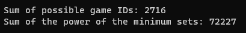

# Cube Conundrum - C++ Solution

## Introduction

This README details the approach and implementation of the "Cube Conundrum" challenge using C++. The challenge involves analyzing games where an Elf shows various combinations of red, green, and blue cubes, and the objective is to infer information about the number of cubes based on these subsets.

## Challenge Overview

The challenge is split into two parts:

1. **Part One**: Identify which games are feasible with a given number of red, green, and blue cubes in the bag, and sum their IDs.
2. **Part Two**: Determine the minimum number of cubes of each color required for each game and calculate the sum of the products of these minimum numbers.

## Puzzle Input

The input is a series of game records, each with an ID and a sequence of subsets of red, green, and blue cubes. For example:
```dotnetcli
Game 1: 12 blue, 15 red, 2 green; 17 red, 8 green, 5 blue; 8 red, 17 blue; 9 green, 1 blue, 4 red
Game 2: 6 red, 6 blue, 2 green; 1 blue, 1 red; 6 green, 1 red, 10 blue
Game 3: 1 green, 2 blue; 7 blue, 4 green; 2 green, 1 blue; 10 blue, 4 green; 4 blue; 1 green, 7 blue, 1 red
Game 4: 16 red, 12 blue, 10 green; 15 red, 5 green, 6 blue; 10 green, 15 red, 12 blue
Game 5: 2 green, 2 red, 9 blue; 1 red, 5 green; 4 green, 12 blue, 1 red; 5 blue, 8 green
```


## Solution Approach

### Part One: Identifying Possible Games

The first part involves determining which games are possible with the specified counts of red, green, and blue cubes. The approach includes:

- Parsing the input to extract each game's data.
- Finding the maximum count of red, green, and blue cubes displayed in any round of each game.
- Checking if these counts are within the limits of available cubes.
- Summing the IDs of the games that meet the criteria.

### Part Two: Minimum Cubes Calculation

The second part focuses on calculating the minimum set of cubes of each color that must be present for each game. This involves:

- Similar parsing as in Part One.
- Computing the product of the minimum counts of red, green, and blue cubes for each game.
- Summing these products to get the final answer.

## C++ Implementation

The solution is implemented in C++, utilizing file reading, string processing, and regular expressions for parsing the input data. Key functions include:

- `extractMaxCount`: Extracts the maximum count for a specific color using regular expressions.
- `main`: Manages reading the input file, parsing each line for necessary counts, and calculating the required sums and products.

### Solution


## Conclusion

The C++ solution effectively handles the challenge, providing insights into the cube counts in each game. It demonstrates string parsing, conditional logic, and arithmetic operations to deduce the required information from the input.