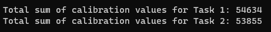

# Trebuchet Calibration Solver

## Overview
This console application is designed to solve a unique puzzle involving the calibration of a trebuchet. The puzzle is split into two tasks, each requiring the calculation of calibration values from a provided input file.

### Task 1
The first task involves reading a file where each line contains various characters, including at least two digits. The goal is to find the first and the last digit in each line, combine them into a two-digit number, and then sum these numbers across all lines.

### Task 2
The second task extends the first by including spelled-out numbers (one to nine) in addition to digits. The goal remains similar: find the first and last "digit" (which could be an actual digit or a spelled-out number) in each line, convert them to their numeric equivalents, form a two-digit number, and sum these across all lines.

## Solution Approach
The solution utilizes C# with .NET, leveraging regular expressions and LINQ for efficient data processing. The program reads the entire input file, processes each line according to the task requirements, and calculates the total sum of calibration values.

### Regular Expressions
- For Task 1, the regular expression `@"\d"` is used to match any single digit in a line.
- For Task 2, the regular expression `@"\d|one|two|three|four|five|six|seven|eight|nine"` is used to match either a single digit or one of the spelled-out number words.

### LINQ Query
The program processes the file's content using LINQ, which provides a concise and readable approach for handling sequences of data. The key steps include:
- Splitting the input into individual lines.
- Using regular expressions to find the first and last "digits" in each line.
- Converting these matches into numeric values.
- Forming a two-digit number from the first and last values and summing them.

### Running the Program
To run the program, ensure the input file `input.txt` is placed in the project root directory. The program will output the total sum of calibration values for both tasks.

### Solution

## Conclusion
This console application provides a clear and efficient solution to the trebuchet calibration puzzle, demonstrating practical usage of regular expressions, LINQ, and C# programming fundamentals.
